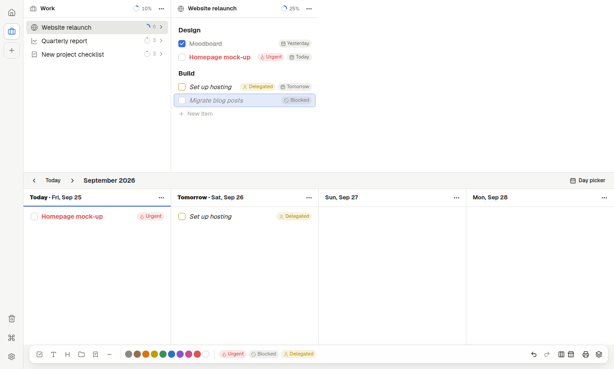

# Cascade

**An open-source, horizontal, column-based nested to-do list for the desktop.**

Instead of one long vertical list, Cascade shows your tasks as horizontally scrolling
columns: open a folder and its contents appear in a new column to the right, so the row of
open columns *is* your breadcrumb. A second lens — a calendar of day columns — shows the
same items in time, with recurring templates that prepare themselves onto upcoming days.

Documents are plain, human-readable `.col` JSON files that you own. Cascade has no accounts,
no cloud, no telemetry, and makes no network requests of its own.



## Features

- **Columns view** — Miller-column navigation of nested folders, per-column progress rings,
  keyboard- and mouse-driven, smooth horizontal scrolling.
- **Calendar view** — per-day columns, drag items between days, split view with the
  columns (`Tab` / `Shift+Tab`). Click the month name for a day picker (pin it to keep it
  open as a column); hold a dragged item over the month name and it springs open, so any
  day is a drop target.
- **Folder dates** — date a folder and its unfinished tasks and sub-folders get the same
  date, shown indented under it on that day. Move the folder and they move with it; give
  one item its own date and it keeps it. New items in a dated folder take its date. Hold
  `Alt` when you drop to date only the folder. A folder row shows the span of dates inside
  it ("Today – Fri").
- **Type a date** — end an item with `@tomorrow`, `@fri`, `@dec 5`, `@+3d` or
  `@2026-10-01` to schedule it (`@none` removes the date).
- **Roll over** — "N overdue → Today" in the calendar bar and a "→ Today" button on past
  days move unfinished work forward (finished tasks stay where they were); optionally
  automatic on open and at midnight.
- **Six item types** — task, text note, heading, separator, folder, and template.
- **Type to structure** — `# ` makes a heading, `---` a separator, `::` opens an inline
  command menu (all three triggers are configurable).
- **Keyboard first** — a dense shortcut map, a fuzzy command palette (`Ctrl+K`) with
  sub-pages (move, schedule, search, icons, tags…), and a context-aware help panel (`F1`).
- **Spaces** — separate top-level areas in one document, with icons, colours, archiving,
  and a Trash space for soft deletion.
- **Tags, colours and icons** — a shared ten-colour palette that adapts to light and dark
  themes; drag colour and tag chips from the toolbar onto items.
- **Conditional formatting** — task and folder rules with all/any logic over tags, text
  (incl. regex), spaces, schedule dates, finished state, and folder statistics
  (progress, overdue/today/future counts…).
- **Recurrence** — daily / weekly / monthly rules (incl. "2nd Tuesday", "last day")
  that copy template contents onto a day when it is prepared.
- **Stack** — a one-task-at-a-time focus session with no timer, a duration, an end time,
  or Pomodoro, plus a compact always-on-top runner window. Optional **remote control**:
  scan a QR code to tick tasks off from a phone on the same network (off by default; a
  new secret link each time, and only the current Stack is shared).
- **Printing** — system print, or task tickets on thermal/receipt printers: raw ESC/POS or
  StarPRNT over CUPS, image tickets via `lp`, Bluetooth LE printers, and MQTT print servers.
- **Undo everything** — every gesture is one undo step (`Ctrl+Z` / `Ctrl+Y`).
- **Safe files** — atomic saves, automatic local backups (10 per document, kept 5 days)
  with **Restore from Backup…** (preview what changed, restore as one undoable step, or
  open a backup as a copy), lenient loading that repairs damaged files instead of refusing them.
- **Calendar export** — dated tasks and folders as an `.ics` file, once or kept next to the
  document and refreshed on every save, so calendar apps can subscribe to it.
- **Scriptable CLI** — open files, print, and prepare calendar days from scripts or cron,
  with JSON results and meaningful exit codes.

## Install

Pre-built `.deb`, `.rpm` and AppImage bundles are produced by CI (see
[`.github/workflows/build.yml`](.github/workflows/build.yml)). To build them yourself, see
below.

## Portable use (USB stick)

The AppImage is a single file that carries its own WebKitGTK and GTK, so it runs on most
Linux distributions from 2022 on without installing anything. To carry Cascade — with its
settings and backups — on a USB stick:

1. Copy `Cascade_x.y.z_amd64.AppImage` onto the stick, next to your `.col` files.
2. Make it executable if needed: `chmod +x Cascade_*.AppImage`.
3. Run it and choose **Settings › General › Make portable…** — or simply create an empty
   folder named `cascade-data` next to the AppImage.

When a `cascade-data` folder sits next to the app, Cascade keeps *everything* there —
preferences, print settings, document backups, logs and caches — and writes nothing to the
host computer's home folder. Documents stored on the stick are remembered relative to it,
so your recent files still open when the stick mounts at a different path on another
machine. To stop using portable mode, rename or delete the folder. (`CASCADE_DATA_DIR=/path`
also forces a specific data folder.)

```
USB stick/
├── Cascade_0.1.0_amd64.AppImage
├── cascade-data/          ← settings, backups, logs (created by "Make portable")
└── My lists.col
```

Notes:

- **File system:** format the stick as **exFAT** (the default for most sticks) or ext4.
  Linux mounts FAT32 sticks so that only `.exe`-style files are executable, which stops
  AppImages from running.
- **FUSE:** the AppImage uses the modern static runtime, so it does *not* need `libfuse2`.
  It still needs kernel FUSE support, which every mainstream desktop has; on a system
  without it, run `./Cascade_*.AppImage --appimage-extract-and-run`.
- **Compatibility:** release AppImages are built on Ubuntu 22.04, so they run on
  distributions with glibc 2.35 or newer (Ubuntu 22.04+, Debian 12+, Fedora 36+, and
  similar). x86-64 only for now.

## Build from source

Requirements: Node.js 22+, Rust (stable), and the Tauri 2 Linux dependencies:

```sh
# Debian / Ubuntu
sudo apt install libwebkit2gtk-4.1-dev libgtk-3-dev libayatana-appindicator3-dev \
  librsvg2-dev libssl-dev libdbus-1-dev libxdo-dev build-essential pkg-config
```

Then:

```sh
npm ci
npm run tauri dev      # run the desktop app with hot reload
npm run tauri build    # produce .deb / .rpm / AppImage in src-tauri/target/release/bundle/
npm run build:appimage # just the AppImage (and delete its 250 MB staging folder)
npm run build:cli      # bundle cascade-cli into dist-cli/cascade-cli.mjs
```

The release binary (`src-tauri/target/release/cascade`, ~8 MB) also runs on its own on a
machine that has WebKitGTK 4.1 installed, and starts faster than the AppImage, which
carries its own copy of WebKitGTK and GTK.

`npm run dev` runs the UI alone in a browser (documents are kept in `localStorage`), which
is handy for UI work. Printing to receipt printers and file dialogs need the desktop app.

## Keyboard shortcuts

| Action | Keys |
| --- | --- |
| Command palette / search items | `Ctrl+K` / `Ctrl+F` |
| Edit selected item | `Enter` or `F2` |
| New item below / new child | `Shift+Enter` / `Ctrl+Enter` |
| Toggle finished | `Space` |
| Navigate / extend selection | Arrows / `Shift+↑↓` |
| Move up, down / to top, bottom | `Ctrl+↑↓` / `Ctrl+Home`, `Ctrl+End` |
| Indent / unindent (next / previous day in calendar) | `Ctrl+→` / `Ctrl+←` |
| Move to… / schedule… | `Ctrl+Shift+←` / `Ctrl+Shift+→` |
| Duplicate / delete to Trash | `Ctrl+D` / `Delete` |
| Copy, cut, paste (as a plain-text outline) | `Ctrl+C`, `Ctrl+X`, `Ctrl+V` |
| Undo / redo | `Ctrl+Z` / `Ctrl+Y` |
| Switch focus Columns ↔ Calendar / cycle visible views | `Tab` / `Shift+Tab` |
| Print / Stack | `Ctrl+P` / `Ctrl+L` |
| New / open / close document | `Ctrl+N` / `Ctrl+O` / `Ctrl+Shift+W` |
| Settings / document settings | `Ctrl+,` / `Ctrl+Shift+,` |
| Help panel / fullscreen | `F1` / `F11` |

While editing: `Enter` finishes and creates the next item, `Esc` stops editing,
`↑`/`↓` move to the previous/next item, `Alt+←`/`Alt+→` jump to the parent/first child.
Items left empty are removed automatically when you leave them.

## Command line

```
cascade [FILE.col]
cascade open FILE [--target ITEM_OR_SPACE_ID]
cascade print <calendar|space|item> --file FILE [--date YYYY-MM-DD | -d N] [--id ID]
              [--option task_tickets|task_tickets_recursive|selection_tickets|selection_tickets_recursive] [--wait]
cascade prepare-calendar --file FILE (--date YYYY-MM-DD | -d N)
```

`prepare-calendar` and `print … --wait` block until the running app has finished, print a
JSON result on stdout, and exit with `0` (prepared / already prepared / printed), `2` (no
matching recurrence rule) or `1` (error). A second launch forwards its arguments to the
running instance. Example cron entry that prepares tomorrow every evening:

```
0 21 * * * cascade prepare-calendar --file ~/Documents/life.col -d 1
```

## Scripts and LLM agents: `cascade-cli` and MCP

`cascade-cli` reads and edits `.col` documents without the app — for scripts, cron jobs,
and to-do-list agents. It uses the same document code as the app, so ordering, folders,
Trash and tags behave exactly as in the UI, and it writes files atomically. If the document
is open in Cascade, the app notices the change within a second and reloads it; edits you
made in the app that were not yet saved are re-applied on top, so neither side's changes
are lost.

Build it with `npm run build:cli` (output: `dist-cli/cascade-cli.mjs`, a single file that
needs only Node.js 22+), then e.g. `ln -s "$PWD/dist-cli/cascade-cli.mjs" ~/.local/bin/cascade-cli`.

```sh
export CASCADE_FILE=~/Documents/life.col         # or pass FILE.col as the first argument
cascade-cli list --parent Work --depth 2
cascade-cli add "Book flights" --parent "Home/Trip" --date tomorrow --tag travel
cascade-cli finish "Book flights"
cascade-cli move "Pack bags" --to "Home/Trip" --first
cascade-cli search invoice --tag waiting --json
cascade-cli agenda                               # the next 7 days, plus overdue work
cascade-cli agenda --from +1 --days 5 --json     # (dates: YYYY-MM-DD, today, tomorrow, +N)
cascade-cli agenda --date tomorrow               # a single day
cascade-cli overdue                              # unfinished work scheduled before today
cascade-cli roll-over                            # move it all onto today
cascade-cli delete "Old idea"                    # to Trash (again: permanently)
cascade-cli backups                              # automatic backups, newest first
cascade-cli restore 1                            # back to the newest backup
cascade-cli export-ics --out ~/life.ics          # dated items as an iCalendar file
```

Before it edits a document, `cascade-cli` (and the MCP server) saves a backup in the same
folder the app uses — at most one every 2 minutes, so a burst of agent edits leaves one copy
of the state before it. Undo an unwanted change with `cascade-cli restore 1` or, in the app,
**Restore from Backup…** (command palette or ≡ menu). `restore` itself backs up the current
content first, so it can be reversed too. If a `<document>.ics` file exists next to the
document (the app's *Keep an .ics calendar copy* setting), every edit refreshes it.

Items can be referred to by id, by exact text, or by path (`"Home/Work/Launch"`); an
ambiguous name is an error that lists the matching ids. Every command accepts `--json`.
Exit codes: `0` ok, `1` error, `2` bad usage. Run `cascade-cli --help` for everything.

### MCP server

`cascade-cli mcp` runs a [Model Context Protocol](https://modelcontextprotocol.io) server on
stdio, giving agents typed tools: `list_items`, `get_item`, `search_items`,
`get_agenda` (a date range, default the next 7 days), `get_overdue`, `roll_over`,
`list_spaces_and_tags`, `add_item`, `add_items`, `update_item`, `set_finished`,
`move_items`, `schedule_items`, `delete_items`, `add_space`, `prepare_day`,
`list_backups`, `restore_backup`, `export_ics`, `create_document`. With `--file`, tools
default to that document.

Claude Code:

```sh
claude mcp add cascade -- node /path/to/cascade-cli.mjs mcp --file ~/Documents/life.col
```

Other MCP clients use the same command in their server configuration:

```json
{ "mcpServers": { "cascade": { "command": "node",
    "args": ["/path/to/cascade-cli.mjs", "mcp", "--file", "/home/me/Documents/life.col"] } } }
```

## The `.col` file format

A document is UTF-8 JSON, written with two-space indentation:

```json
{
  "file_version": 4,
  "configuration": { "spaces": [], "tags": [], "conditionalFormatting": [],
                     "recurrenceRules": [], "preparedDays": [], "progressionMode": "by_level",
                     "viewState": {} },
  "items": [
    { "id": "…", "t": 90, "parent_id": "root", "position": "a0", "text": "Project" },
    { "id": "…", "t": 1, "parent_id": "…", "position": "a0", "text": "A task", "finished": true }
  ]
}
```

Items are a flat list; the tree is rebuilt from `parent_id`, and sibling order is a
fractional-index string in `position` (so moving an item rewrites only that item). Type codes
in `t`: `1` task, `2` text, `3` separator, `4` heading, `90` folder, `91` template.
Defaults are omitted; `c` is a colour index (0–9), `ic` an icon name, `tg` a tag-id list.
A calendar placement is `scheduleDate` + `schedulePosition`. The reader also accepts
older versions (a bare item array, `file_version` 2 and 3) and upgrades them on open.

This format is compatible with documents from the commercial app *Colonnes*; Cascade is an
independent project, not affiliated with or endorsed by its author, and contains none of
its code.

## Privacy

Cascade reads and writes only the files you open, its settings, and its backups. It never
contacts a server. The only network traffic it can produce is what *you* configure: sending
print jobs to an MQTT broker, or to a network printer through CUPS. Stack remote control,
when you turn it on, serves the current Stack (never the document) on your local network
behind a random token, and stops when the Stack ends.

## Architecture

```
src/model/     pure TypeScript: types, .col codec, ordering keys, tree index,
               progression, conditional formatting, recurrence, outline (clipboard) format,
               folder date rules (schedule.ts), iCalendar export
src/state/     zustand store with immer-patch undo (folder date rules run inside each
               transaction); operations (items, config, navigation, scheduling), shortcut
               table, file lifecycle, autosave and backups, CLI handling, Stack
src/print/     ticket building, canvas rasterisation, ESC/POS encoding, print dispatch, UI
src/ui/        React components (columns, calendar, overlays, palette, settings)
src/platform/  Tauri plugins in the desktop app, localStorage fallback in a browser
src/headless/  cascade-cli and the MCP server (reuse the store headlessly)
src-tauri/     Rust backend: CLI reply protocol, single instance, CUPS (lp), Bluetooth LE
               (btleplug/BlueZ), MQTT (rumqttc), Stack remote-control server, packaging
```

Run the tests with `npm test` (TypeScript) and `cargo test` in `src-tauri/` (Rust).

## License

[MIT](LICENSE)
